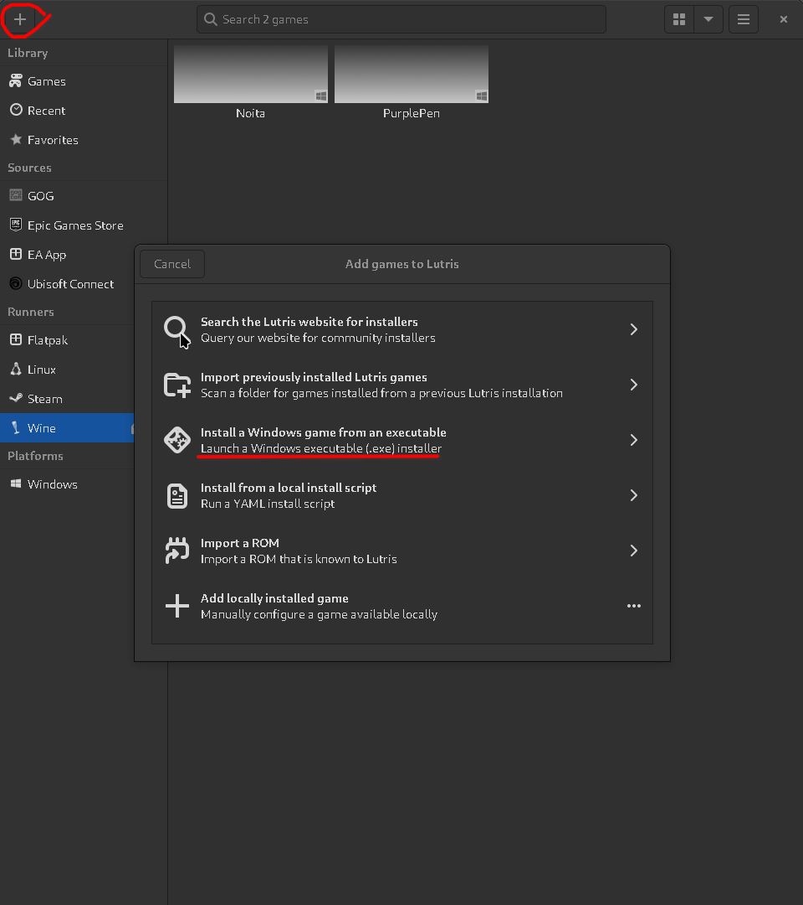
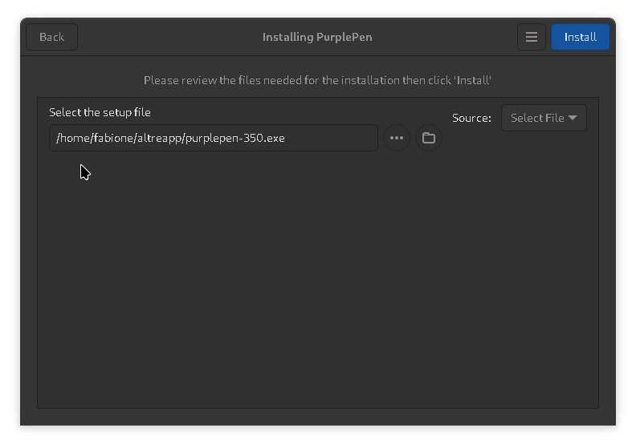
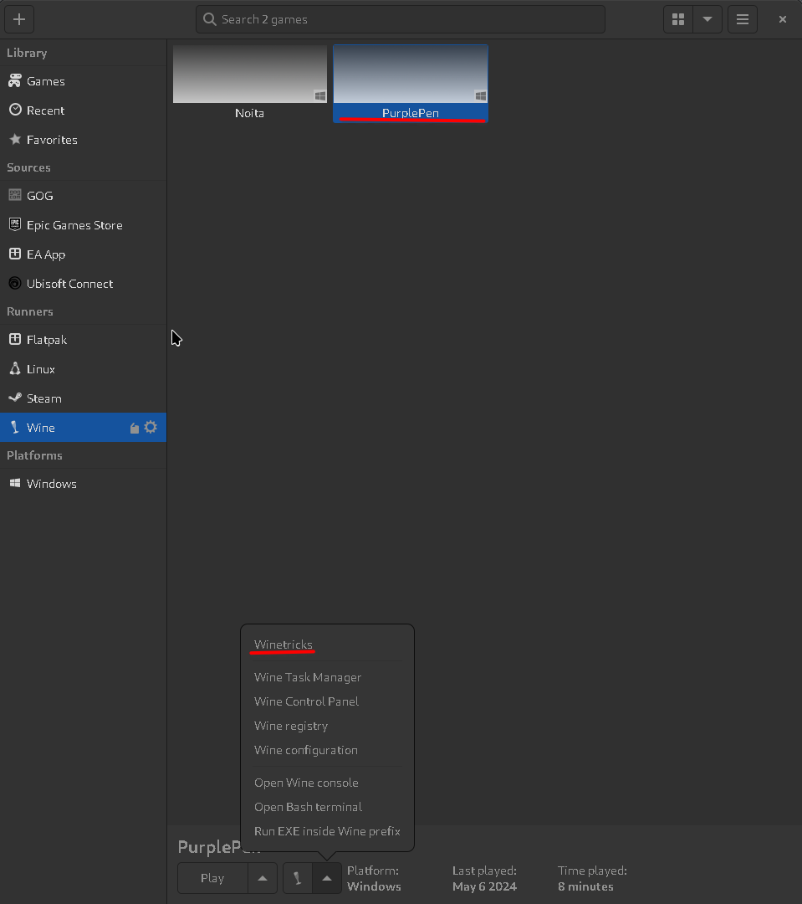
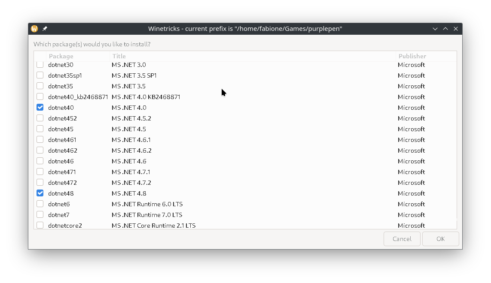

# use PurplePen on any linux distro

## prerequisite

1. [install flatpak](https://flatpak.org/setup/)
2. [install lutris](https://flathub.org/apps/net.lutris.Lutris)
3. install wine runner for lutris

## install purplepen

1. [download purplepen .exe file](https://purple-pen.org/)
2. click on + and install a window game from an executable 
3. fill inforamtion
4. choose purplepen-XXX.exe  and click on install

now it is installed but doesn't works, it needs dotnet48

## install dotnet48

1. select purplepen and open winetriks 
2. select select the default wineprefix, click ok
3. select install a Windows DLL or component
4. select dotnet48 and click ok  now proceed the installation, it can take several minuts (10 min)

now you can launch PurplePen and it should works

## install gdiplus

Without this, when exporting some lines and objects in the pdf are misplaced and/or corrupted

To install this, the procedure is the same as installing **dotnet48**

## Have fun setting courses

If somethings is not working, open a issue :\)